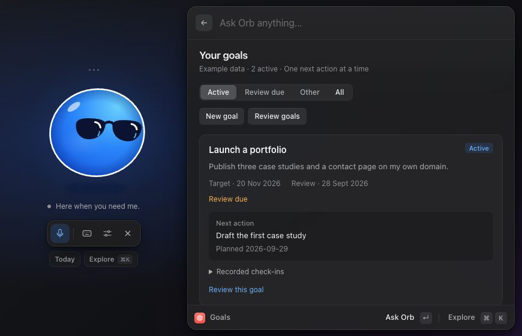

# Vault Orb

A compact Mac voice assistant for your Obsidian vault. Talk or type to find notes, manage tasks, work towards goals, track habits, review your calendar, view Trading 212 investments, and explore data. Orb shows a companion panel when a task list, goal card, calendar, or chart helps.

Your vault stays in Markdown. Orb reads it directly and records its note edits with undo. Choose OpenAI or OpenRouter for chat and tools, with an optional separate reasoning model. Voice can use OpenAI Realtime or a Deepgram → chosen chat model → ElevenLabs pipeline. [Provider setup](docs/providers.md) explains each combination.

[](docs/images/goals-view.png)

## Quick start

You need an **Apple Silicon Mac**, **Node.js 22+**, **npm**, **Xcode Command Line Tools**, a location for your vault, and an OpenAI or OpenRouter API key with access to a tool-capable text model. Voice needs the credentials for your chosen voice mode. Provider API billing is separate from consumer chat subscriptions. Windows, Linux, and Intel Macs are not supported.

From a checkout of this repository:

```sh
npm ci
npm run build:native
npm start
```

In Settings, click **Create new…**, choose a location and a new folder name, then save settings. Orb creates its complete Markdown system: Life and Business tasks, goals, habits, Portfolio, Hubs, Topics, Knowledge Library, and reusable templates. Records start empty; no personal or financial records are included. Add your API key for conversations; voice also needs microphone permission.

**Connect existing…** accepts a vault with the same structure. Existing saved installations retain their configured paths. You can also copy [the clean starter vault](vault-template/) manually.

Use the same folder in Obsidian without Orb: [standalone Obsidian guide](docs/obsidian-only.md). It covers Bases, Dataview, Templater, optional calendar setup, and how the knowledge system works. No export is needed.

Optional: connect a read-only Trading 212 API key and secret in **Settings → Integrations → Trading 212**, then open **Explore → Trading 212**. Browsing investments needs no AI-provider key. See [Trading 212 setup](docs/features/trading212.md).

See [Getting started](docs/getting-started.md) for the complete setup, optional integrations, and the first five minutes with Orb.

## What can I ask?

These are natural-language examples, not fixed commands. Orb uses current vault data and may ask for missing details. Requests to create or edit items make real changes; each guide explains the destination and prerequisites.

| Feature | Try saying | Guide |
| --- | --- | --- |
| Today and discovery | Click **Today** or **Explore** beneath the orb. | [Today and Explore](docs/features/today-and-explore.md) |
| Tasks | “Show today's tasks.” | [Tasks](docs/features/tasks.md) |
| Goals | “Let's review my goals.” | [Goals and weekly reviews](docs/features/goals.md) |
| Habits | “Show my habits.” | [Habits and heatmaps](docs/features/habits.md) |
| Task scheduling | “Find me 45 minutes this week for Draft proposal.” | [Linked task blocks](docs/features/task-scheduling.md) |
| Calendar | “What's on my calendar next week?” | [Calendar](docs/features/calendar.md) |
| Knowledge and graph | Open **Explore → Knowledge**, or “Show my knowledge graph.” | [Knowledge system](docs/features/knowledge.md) |
| Notes | “Find my notes about pricing.” | [Finding and updating notes](docs/features/notes.md) |
| Trading 212 | “Show my Trading 212 portfolio.” | [Trading 212](docs/features/trading212.md) |
| Data and charts | “Find my CSV and help me chart it.” | [Spreadsheets and visuals](docs/features/spreadsheets-and-visuals.md) |
| AI daily planner | “Help me plan today; finish by three.” | [Plan my day](docs/features/daily-planner.md) |
| Planning | “What can I do today to move my goals forward?” | [Planning across notes](docs/features/planning.md) |
| Voice and controls | Double-tap Control to summon Orb. | [Voice and controls](docs/features/voice-and-controls.md) |
| Change history | “Undo your last note edit.” | [Changes and undo](docs/features/changes-and-undo.md) |

The [Things to ask Orb cookbook](docs/things-to-ask.md) has copyable examples and workflows you can try in your own vault. The [documentation index](docs/README.md) lists all guides.

## Everyday use

Click the menu-bar Orb, use the Dock icon, or double-tap Control. **⌘⇧Space** is the fallback shortcut. Click the orb to talk or the keyboard icon to type. **Today** opens a daily dashboard (refreshing existing calendar links), while **Explore** (⌘K) is a searchable list of views and starting prompts, so you do not need to memorize commands. **Escape** or × hides Orb and stops voice and pending work. Settings contains Recent changes and the conversation transcript. **Settings → Appearance** offers colour presets and a custom picker, with live preview and a choice saved on this Mac; see [colour controls](docs/features/voice-and-controls.md#choose-your-orb-colour).

Today brings together tasks planned or due today, past deadlines, active goals, habit progress, calendar events, and knowledge notes you chose to revisit. Knowledge adds Hub/Topic browsing, capture, source-based learning, Portfolio drafts, and connection review. A corner graph expands into an interactive view of your linked notes. Its sections stay independent, so an unavailable optional integration is reported without hiding the rest of the day. Goals, habits with heatmaps, task lists, calendar agendas, and charts also appear beside the orb as needed. Source links open Markdown notes in Obsidian; spreadsheet links open in the default local application.

## Your data and current limits

Your provider keys, optional calendar token, and Trading 212 credentials are encrypted locally. During use, audio goes to your chosen voice providers and relevant retrieved vault content and requested Trading 212 data go to the selected chat/reasoning providers. Opening the investment dashboard directly makes no AI request. OpenRouter routes requests to a model host. This is not an offline assistant. The app does not store recorded audio. Typed chats are saved locally; voice conversation transcripts remain in memory for the session. See [Privacy and data](docs/privacy.md) for local files, chat retention, the edit journal, calendar connections, and sharing precautions.

Task support requires one Markdown note per task in two configured folders. Orb can create/edit single Google Calendar events and book linked task blocks after setup. Linked blocks can be removed; calendar writes cannot use ordinary note undo. Spreadsheets and the Trading 212 connector are read-only. Trading 212 supports one Invest or Stocks ISA account at a time, with no trading actions; optional encrypted local history is collected while Orb runs and the Mac is awake. Goals have a weekly review workflow, but no background reminder scheduler. Feature guides describe the precise limits.

## Contributing and development

Start with [CONTRIBUTING.md](CONTRIBUTING.md). [Development](docs/development.md) covers architecture, tests, browser previews, native builds, packaging, and updating a locally installed app. Run `npm test` for offline tests using temporary vaults and fictional data.

[Vault format](docs/vault-format.md) documents the supported properties and conventions. [Troubleshooting](docs/troubleshooting.md) covers setup, missing notes/tasks, voice, calendars, and edit conflicts.

## License and distribution

The app source and clean starter vault are released under the [MIT license](LICENSE). The public starter contains no real records, API key, or private calendar feed. Private reference vaults are excluded from Git and packaging. `private: true` in package.json prevents accidental npm publication; the source is open.

This is a source project with a local Mac build workflow, not a signed or notarized public app release. Packaging creates an app under `dist`; it does not replace an installed copy. See [Build and install](docs/development.md#build-and-install) for details.
