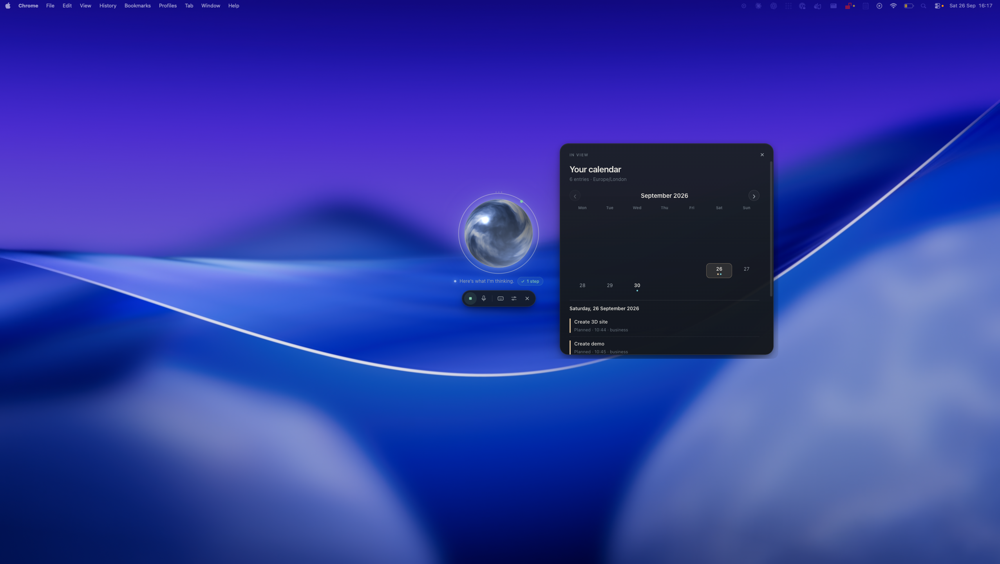
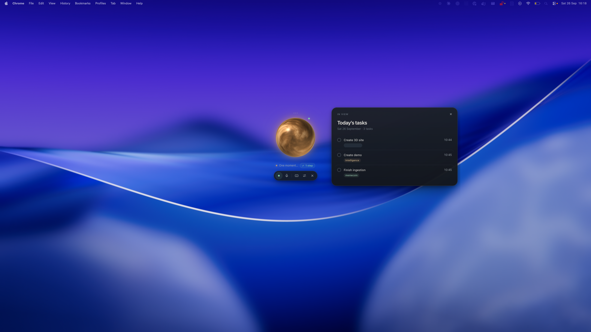

# Vault Orb

A compact Mac voice assistant for an Obsidian vault. OpenAI Realtime handles speech; the `think_deeply` tool delegates complex work to **gpt-6-sol**. Both use one OpenAI API key.

## Requirements

**To run Vault Orb from source:**

- An **Apple Silicon Mac**, **Node.js 22 or newer**, **npm**, and **Xcode Command Line Tools**. Windows, Linux, and Intel Macs are not currently supported.
- An **Obsidian vault folder** on your Mac. It can be anywhere, including iCloud. You can use your own vault or copy the fictional [`vault-template/`](vault-template/) to a separate folder.
- Your own **OpenAI API key** with access to `gpt-realtime-2.1` and `gpt-6-sol`, plus an internet connection. API usage is billed separately from a ChatGPT subscription. The app can open without a key, but its assistant cannot answer until you add one.

**To save the vault in Settings:** the vault must contain **two existing, separate task folders**, one for personal tasks and one for work tasks. Enter each folder's path relative to the vault root. The default paths are `0. Home/Life Tasks` and `0. Home/Business Tasks`; you can change both. If you enter a task rules note path, that Markdown file must also exist. Leave the field blank if you do not use one. These folder checks apply even if you only intend to search general notes.

**For task features:** each task must be its own Markdown note in one of those folders, with YAML frontmatter containing `type: task`. The other supported fields are explained under [Vault layout and task format](#vault-layout-and-task-format). Other Markdown notes can be searched without this format.

**Optional:** allow macOS microphone access for voice; typed requests do not need it. Install Obsidian to open source-note links from Orb. Install and configure **Full Calendar Remastered** with an HTTPS iCal feed only if you want calendar events; planned and due task dates work without that plugin.

## Quick start

Install the requirements above, then run:

```sh
npm ci
npm run build:native
npm start
```

On first launch, open Settings, choose your vault, check the two task-folder paths, optionally set a task rules note, and enter your API key. The example notes in `vault-template/` are fictional; replace or delete them in your copy.

Your real vault can live anywhere you choose, including iCloud. Orb stores the chosen path and encrypted key under `~/Library/Application Support/Vault Orb/`, outside this source tree. Do not commit a real vault, an API key, calendar feed URLs or that application support folder to a public repository.

The app does not ship with a real vault, key, or private calendar feed URL.

## Use

- Click the **menu-bar Orb** or the Dock icon to summon the floating orb. Right-click the menu-bar icon for Settings and Quit.
- **Double-tap Control** to summon Orb from another app, or hide the focused orb. No Input Monitoring or Accessibility permission is needed. A native worker checks the public modifier-state API every 8 milliseconds and cancels the gesture if another key or mouse button is used. It never reads or records typed text.
- **⌘⇧Space** remains a fallback shortcut. **Escape** or × hides Orb and stops voice/pending work.
- Click the orb to talk. The keyboard icon reveals typed input. Settings contains recent changes with undo and the conversation transcript.
- Small labeled orbs appear around the main orb while tools run. A check or warning remains visible when each tool finishes, so task edits have a clear result.
- By default, summoning Orb starts listening when a key is saved. Disable this in Settings if preferred. The microphone status is shown beneath the orb.
- Drag the small dots above the orb to move it. It floats above normal windows and can appear on other Spaces.

## Screenshots

Click an image to view it at full size.

**Listening**

[](docs/images/orb-listening.png)

**Calendar view**

[](docs/images/calendar-view.png)

**Today's tasks**

[](docs/images/today-tasks.png)

## Contextual visuals

There is no permanent dashboard. A companion card appears when useful:

- “What is on today?” → a source-backed task table, generated directly from the task records.
- “What’s on my calendar next week?” → the right-hand panel opens automatically with a month grid and selectable day agenda. It shows events from Full Calendar Remastered's configured iCal feeds and can include planned and due task dates. Feed warnings appear in the panel.
- “Compare the options in this note” → a table extracted from the note.
- “Chart my savings over time” → a line, area or bar chart, with units, source links, hover values and a **View data** table.
- Numerical questions with comparable sourced values can bring up a chart automatically, even without saying “show me a chart.”

The model supplies validated chart/table data, never executable HTML or scripts. The task table and calendar view are generated directly from tool results. Model-generated visuals must cite files already read by the assistant. Missing numeric observations stay missing. This verifies the data shape and source access; interpretation of unstructured text still depends on the model and should be checked against the linked source.

The tools can discover and read `.xlsx`, `.csv` and `.tsv` files within the vault. Workbook metadata is inspected before reading bounded cell ranges (up to 4,000 cells per call, files up to 20 MB). Excel formula results are cached values and **are not recalculated**. Legacy `.xls`, PDFs and images are not currently parsed. Note content search is keyword-based Markdown retrieval; plain text files can also be read after locating them by filename.

Calendar queries read Full Calendar Remastered's iCal sources from its vault settings. Orb fetches each HTTPS feed locally, caches it in memory for five minutes, expands recurring events, and uses the plugin's display timezone. The private feed address is never sent to the model; event details are sent only when a calendar query is made. Planned and due task dates come from the task notes. Use the arrows to move between months in the requested date range, then select a day to see its agenda; task titles can open their source notes in Obsidian. If a feed fails, the panel warns that the calendar may be incomplete. Calendar queries are read only and cover up to 93 days at a time. Other Full Calendar source types are not currently supported.

### Calendar write access and task scheduling

An iCal subscription, including a private Google Calendar `.ics` URL, provides read access only. Vault Orb **cannot currently create calendar events or place tasks in free slots**. Granting Google access to Obsidian alone does not add that ability to Orb.

The simplest planned route for a vault using Full Calendar Remastered is:

1. Open **Obsidian Settings → Community plugins → Full Calendar Remastered → Calendars**. Under **Manage calendars**, change the **Add calendar** menu from **Full note** to **Google calendar**, then click **+**. Follow the Google sign-in and event-access prompts, and select the calendar you want to write to.
2. Confirm that you can create an event on that Google calendar in Obsidian. Only after that works, remove the old iCal calendar source if it shows duplicate events.
3. Open the plugin's **Integrations** tab. Enable **Local REST Server**. It listens on `127.0.0.1` (default port `8540`) and requires Obsidian to remain open while Orb uses it.
4. When Orb's connector is available, use **Personal Access Tokens → Generate Token**. Name it **Vault Orb** and grant **Read events** (`events:read`), **Write events** (`events:write`), and **Read providers** (`providers:read`). The plugin shows the token once. Store it securely; do not put it in a vault note, source file, commit, or chat message.

The installed plugin exposes local endpoints for listing calendars and events and creating events with those scopes. Orb still needs a secure token field and a scheduling tool before step 3 is useful. That tool will also need a target calendar, task durations or a default duration, usable hours, and duplicate/conflict checks. No Google Calendar write permission or automatic scheduling is present in the current build.

## Vault layout and task format

Each task is a Markdown note in one of the two configured task folders. The file name is its task title. A typical task looks like this:

```yaml
---
type: task
category: Inbox
planned: null
due: null
completed: false
---
```

Only `type: task` is required to recognize an existing task. If `completed` is absent, Orb treats it as unfinished; if `category` is absent, it displays `Inbox`. `planned` and `due` may be absent or use `YYYY-MM-DD`, a local `YYYY-MM-DDTHH:mm:ss`, or `null`. Work tasks may also have `venture: Example Studio`. New tasks created by Orb include the fields shown above. The [`vault-template/0. Home/Task Rules.md`](vault-template/0.%20Home/Task%20Rules.md) note shows sample conventions. Orb reads the configured rules note as assistant guidance, but that note **cannot change the folder paths or YAML fields**; set folder paths in Settings.

The task parser currently supports exactly **two task lists** and these field names. Checkbox tasks, Obsidian Bases views, other field names, and more task lists need code changes. Markdown notes elsewhere in the vault remain searchable. Today means an unfinished task planned **or** due on the current local date; past deadlines remain separate.

## Tasks and changes

Tools can add/update tasks, append to notes and undo app edits. Completion requires an explicit request. Writes check note versions, preserve other frontmatter fields and body content, and retain local undo records. Undo refuses to overwrite newer external changes. The change journal is not a substitute for a separate backup. Avoid editing the same note in two apps at exactly the same time.

Successful edits refresh a task table already in view, including task completion, note edits and Undo from Activity. Completed tasks leave the default unfinished list immediately. If a new task falls outside the current date filter, Orb shows all tasks so the addition is visible.

## Key and data

Settings and the edit journal live in `~/Library/Application Support/Vault Orb/`. The API key is encrypted with Electron `safeStorage`, backed by macOS Keychain, and is never returned to the interface. The permanent key is used only by the app's main process.

While connected, microphone audio goes to OpenAI. Relevant notes, task records and spreadsheet ranges are sent when tools read them. The app does not store recorded audio; transcripts remain in memory. Responses requests use `store: false`; OpenAI's normal API data handling applies. API billing is separate from a ChatGPT subscription. No OpenRouter account is needed.

## Development

Requires macOS Apple Silicon, Node.js 22+, npm and Xcode Command Line Tools.

```sh
npm ci
npm test
npm run build:native
clang++ -std=c++17 native/shortcut-test.cc -o /private/tmp/orb-shortcut-test
/private/tmp/orb-shortcut-test
npm start
npm run package
```

The build script finds Node's headers from the installed Node binary. The N-API module reads modifier flags and event counts, without creating an event tap, and is copied beside the packaged app archive. Packaging produces `dist/Vault Orb-darwin-arm64/Vault Orb.app`. To update a Spotlight-installed copy, quit every running Vault Orb copy, keep a backup of the prior app, then run:

```sh
codesign --force --deep --sign - "dist/Vault Orb-darwin-arm64/Vault Orb.app"
ditto "dist/Vault Orb-darwin-arm64/Vault Orb.app" "$HOME/Applications/Vault Orb.app"
open "$HOME/Applications/Vault Orb.app"
```

Rebuilding source or packaging into `dist` alone does not update the installed app; Spotlight may list both copies. This local build is not a notarized public release. The key and vault settings live separately. The public build uses bundle ID `app.vaultorb.desktop`; an older local build with a different ID may need fresh macOS permissions or the API key entered again. The source repository excludes the generated app and native binary.

## Open source

The app source and the fictional vault template are released under the [MIT license](LICENSE). `package.json` uses `private: true` only to prevent accidental publication to npm. The repository does not include a distributable signed or notarized Mac app. The optional `scripts/install.py` installs a locally built app and changes local Dock preferences; review it before running it.

## Validation

Run `npm test` for 33 offline tests covering task edits and undo, configurable vault paths, calendar data and views, spreadsheets, charts, API errors, cancellation, and source validation. The native gesture test rejects key combinations, long holds, and slow taps. `npm run package` builds the Apple Silicon app. A small `shortcut-status.json` diagnostic records only whether the listener is active and counts of Control presses and recognized gestures, never key contents. Public signed and notarized builds are not yet provided.
