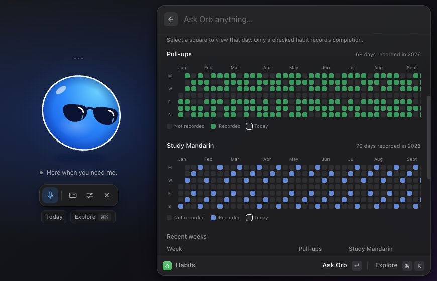

# Habits and weekly rhythm

[Documentation](../README.md) · [Things to ask Orb](../things-to-ask.md) · [Vault format](../vault-format.md#habit-records)

Habits are actions you repeat and record. Orb shares daily Markdown records with your vault's Dataview dashboard and displays weekly progress, annual heatmaps, and eight recent weeks. No separate database, service, or heatmap plugin is needed.

| Concept | Purpose | Example |
| --- | --- | --- |
| Goal | Outcome with a finish line | Hold a short conversation in Mandarin. |
| Weekly objective | Result chosen for this week | Finish a particular lesson. |
| Task | Concrete next action | Choose a lesson and give it a Planned date. |
| Habit | Repeated action recorded over time | Study Mandarin twice weekly. |

## Setup

Use your existing habits dashboard, or copy the fictional [sample vault](../../vault-template/) to a separate folder. The sample has Pull-ups (7 days/week) and Study Mandarin (2 days/week), and **no recorded completions**.

In Settings, the defaults are:

- **Habit log folder:** `0. Home/Habit Log`. Create it first. It must be separate from goal and task folders. Blank disables habits.
- **Habit dashboard script:** `99. System/99.4 Scripts/habits/view.js`. Orb reads the literal `const habits = [...];` definitions from this file as data; it never executes the JavaScript. This keeps names, keys, colors, and targets aligned with Obsidian.

Missing files show setup guidance without affecting other features. Orb does not require Dataview or Obsidian to be running to read or save records. To render the sample dashboard **inside Obsidian**, install Dataview, enable JavaScript queries, and open Habits in Reading view or Live Preview. Orb does not change plugin settings.

## Open and use the panel

Open **Today** beneath the orb and click **Open habits**, or say **“Show my habits.”** The Today route and logging controls work locally without an assistant request. Conversations need the usual API setup.

- Pick today or a past date. Check a habit to record completion; uncheck to remove it.
- Select a heatmap square to view that day's checkboxes. Selecting alone never logs activity.
- Use **Today** to return to today and **Refresh** to reread external changes.
- **Create / open daily record** creates a missing Markdown record with false values, then opens it in Obsidian. **Open daily record** opens an existing one.
- Use the year arrows to browse history. Dates after today cannot be selected or logged.
- Tab into each heatmap and use arrow keys: up/down moves a day; left/right moves a week. Enter or Space selects a date. Labels describe the date, habit, and recorded state.

Weekly cards always show the **current Monday–Sunday week**, even when you select a historical date or year. Counts are days, not repetitions or sessions. The recent-weeks table shows this week and seven preceding weeks, including totals against each habit's target.

Each habit uses its configured color. A colored square means recorded, an empty square means not recorded, a faded square means future, a pale outline marks today, and a gold highlight marks the selected date. Heatmaps scroll horizontally in a narrow panel. Unreadable records have a striped square and a warning; affected totals may be incomplete.

## Things to ask

| Request | Result |
| --- | --- |
| “Show my habits.” | Reads records and opens the native heatmaps and progress cards. |
| “Record pull-ups for today.” | Writes today's completion, then refreshes the panel. |
| “I studied Mandarin yesterday. Log it.” | Writes one completion for yesterday. |
| “Remove yesterday's pull-ups completion.” | Changes that boolean to false, preserving other activity and notes. |
| “Show my habit heatmaps for 2025.” | Reads that year while weekly cards still describe the current week. |
| “Use my habit history to help review my language goal.” | Reads evidence and guides a goal review; never infers achievement. |
| “Undo your last note edit.” | Reverses the last eligible Orb edit, including a habit log change. |

Use the actual labels in your own dashboard. These examples describe supported requests, not live model test transcripts.

## A complete practice walkthrough

In a disposable copy of the sample vault:

1. Open Today and click Open habits. Expect empty heatmaps and zero recorded days.
2. Check Pull-ups for today. Expect a green square, one recorded day, and a daily Markdown record.
3. Select yesterday and check Study Mandarin. Expect a blue square. On Monday, yesterday belongs to the preceding week's row, not the current week's card.
4. Open the daily record, inspect its properties and Notes section, then return to Orb.
5. Ask Orb to undo its last note edit, or use Settings → Recent changes. The corresponding completion disappears. If undo reverses the creation of a new record, that file is removed.

Only record real completions in your actual vault. Nothing is inferred from visiting the gym, a scheduled lesson, completed tasks, or goal text.

## Goals and This Week

Habit history supplies evidence for goal reviews. You still decide what progress means and whether a goal is achieved. A goal such as “twice weekly for six consecutive weeks” requires inspecting those weeks; Orb does not automatically set its status.

`0. Home/This Week.md` is an ordinary planning note: choose up to three outcomes, link goals and existing tasks, review results, move them into Previous weeks, and update the dated heading yourself. It has no automatic reset or dedicated editor in Orb. General note tools can read it or append requested text. Concrete actions stay in the existing task lists.

## Data, undo, and limits

Records use `YYYY-MM-DD.md` filenames in the configured log folder. Only the YAML boolean `true` counts. False or a missing property means **not recorded**, without distinguishing an explicit skip. Each habit counts once per date. Today's local calendar date is refreshed on every read; click Refresh after leaving the panel open overnight.

Viewing, date selection, and year navigation write nothing. Checkbox edits preserve other properties, comments, and body text. Orb journals edits and checks both record and definition versions before writing. If another app changes the record or definitions, refresh before retrying. Undo refuses to overwrite later external edits. Obsidian's own writes do not enter Orb's journal.

Names and weekly targets come from the script, with 1–12 habits and targets from 1–7 days. Orb has no habit-definition editor, reminders, repetitions, duration tracking, streak scoring, automatic scheduling, or background file watcher. Keep property keys stable; renaming a key does not migrate old activity. Changing a target changes comparisons for older weeks too. See the [definition contract](../vault-format.md#habit-definitions).

## Troubleshooting

**Setup message:** check both configured paths and create the log folder if absent. A missing or unsupported script never silently substitutes different habits.

**Unexpected totals:** inspect the selected year, current-week dates, filename, and boolean types. Warnings explain invalid values or unreadable notes. Future records are ignored.

**Changes from Obsidian are missing:** use Refresh in Orb; reopen the Dataview note to refresh its cached display after an Orb edit.

**Save conflict:** refresh and review the external change before retrying. No stale checkbox edit should overwrite it.

Implementation and verification: [Habits internals](../habits.md).
