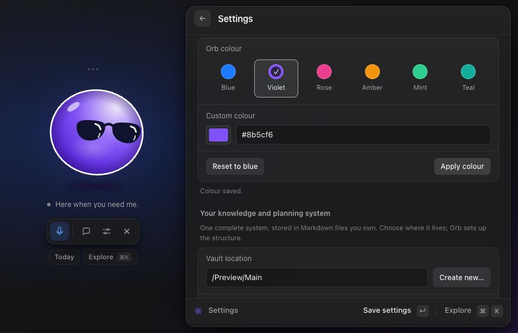

# Voice and controls

[Documentation](../README.md) · [Getting started](../getting-started.md) · [Privacy](../privacy.md)

Vault Orb floats above your normal Mac windows. Smith (Agent Smith) is the assistant you speak or type to; supporting information appears in a companion panel. The microphone tooltip says **Talk to Smith**, the chat button says **Chat with Smith**, and voice transcript replies are labelled **Smith**.

## Setup

Choose your chat/tools model and voice mode in Settings. OpenAI Realtime needs an OpenAI key; independent voice needs Deepgram and ElevenLabs keys plus the key for your selected chat model. See [Models and providers](../providers.md). Voice also needs macOS microphone permission, requested when you start a conversation. Typed requests work without microphone access. The native shortcut is built with `npm run build:native` and included in packaged builds.

By default, summoning Smith starts listening when a key is saved. Turn off **Start listening when I summon Smith** in Settings if you prefer to click Talk manually.

## Controls

| Action | How |
| --- | --- |
| Summon Smith | Click the menu-bar Orb or Dock icon, double-tap Control, or press ⌘⇧Space. |
| Hide the focused orb | Double-tap Control again, press Escape, or click ×. If you have typed in the panel's top field, the first Escape clears it. |
| Start voice | Click the orb or the microphone button labelled **Talk to Smith**. |
| End voice | Click the stop button, or hide Orb. |
| Mute input during voice | Click the mute button; click again to unmute. |
| Chat | Click the chat icon or press ⌘J. The orb folds away and the chat window opens. Return sends; Shift-Return adds a line. |
| Switch, start, or archive chats | Use the chat list on the left: ⌘N starts a new chat, the archive icon on a row or in the header moves it to **Archived**, and archived rows can be restored or deleted (click Delete twice). |
| Tools and commands in chat | Type `@` to point Smith at a tool (Trading212, Calendar, Tasks, Goals, Habits, Notes, Sheets), `/` for commands (`/new`, `/archive`, `/today`, `/trading212`, `/settings`, `/orb`), or click + (⌘K) for both. |
| Return to the orb | Click the back arrow at the top left of the chat window, or type `/orb`. |
| Review today | Click **Today** beneath the controls to combine today's tasks, past deadlines, active goals, habit progress, and calendar events. See [Today and Explore](today-and-explore.md). |
| Discover requests | Click **Explore** or press ⌘K for a searchable list of views and starting prompts covering planning, goals, habits, calendar, knowledge, Trading 212 investments, notes, and spreadsheet data. See [Today and Explore](today-and-explore.md). |
| View investments | Open **Explore → Trading 212**, or choose `/trading212` in chat. This directly opens the read-only dashboard; `@Trading212` points a conversational request at the connector. See [Trading 212](trading212.md). |
| Go back in the panel | Click the arrow at the top left of the panel. It returns to the view you came from, or closes the panel. |
| Focus on something | Press the clock beside a task, open **Explore → Focus session**, or ask “Give me 25 minutes on …”. A ring around the orb shows progress; pause and end buttons sit beside the status line. See [Focus sessions](focus-sessions.md). |
| Move the window | Drag the small dots above the orb. |
| Change orb colour | Settings → Appearance: choose a preset or custom colour, then **Apply colour**. |
| Open Settings | Click the sliders icon, use the menu-bar right-click menu, or ⌘,. |
| Inspect the last request's tools | Click the steps chip beneath the orb. |
| Read the conversation | Settings → Conversation. |
| Inspect/undo note edits | Settings → Recent changes. |
| Quit the app | Right-click the menu-bar icon and choose Quit Vault Orb. |

Double-tap Control reads public modifier state and rejects gestures mixed with other keys or mouse buttons. It does not record typed text and needs neither Input Monitoring nor Accessibility permission. ⌘⇧Space is a fallback if the native listener fails.

Today reconciles previously linked task blocks when refreshed; other dashboard sections are read-only. Each section reports its own setup or source warning, so a missing calendar connection or disabled optional feature does not prevent available task, goal, or habit data from appearing. Discovery prompts are ordinary assistant requests: selecting one uses the same voice/text tools, permissions, and write rules as typing it yourself.

## Choose your orb colour

Open **Settings → Appearance** and choose **Blue, Violet, Rose, Amber, Mint, or Teal**. For another colour, use **Custom colour** or enter a six-digit hex value such as `#8b5cf6`. The orb previews valid changes immediately. Its shading, glow, ring, lens reflections, and small chat illustrations follow your choice. Explore, chat suggestions, and command menus use plain icons in the orb’s colour, without coloured background tiles; listening, thinking, and speaking retain their animations and status labels. Very dark and pale colours receive lighter and darker tones so the orb keeps its shape.

Click **Apply colour** to save appearance independently, even before connecting a vault or entering provider keys. **Save settings** also saves the colour along with the rest of the form when those settings are valid. **Reset to blue** previews the original blue; apply or save to keep it. Leaving Settings or hiding Orb discards an unapplied preview. Invalid hex input leaves the last valid preview visible and shows a correction message.

When a weather forecast arrives, the orb briefly tints icy blue in the cold or amber-red in the heat, and shimmers when it's wet. After about five seconds it returns to your chosen colour; your saved colour never changes. Turn this off in **Settings → Connectors → Weather**. Your choice is stored on this Mac and survives restarts and vault changes. It makes no network request and does not edit vault notes. If saving fails, the previous saved colour remains intact and the draft stays available to retry. Opening Settings ends an active voice session. The browser preview keeps applied colours only until the page reloads.

## Things to ask

Voice and typing share the feature tools. Examples:

- **“Show today's tasks.”** Opens the task panel and gives a brief spoken summary.
- **“Show my goals.”** Opens goal cards with source links and filters.
- **“What's on my calendar next week?”** Reads configured calendars and opens the agenda.
- **“Do I need a jacket?”** Opens the [weather](weather.md) card and answers in a sentence. In voice, Smith checks the weather directly rather than handing it to the chat model, so the answer is quicker.
- **“Compare the options in Notes/Example launch options.md.”** Can use deeper reasoning and a supporting table.
- **“Close the visual.”** Dismisses the companion visual; it does not quit the app.

These requests need the same files and integrations as their feature guides. There are no special voice-only phrases needed to unlock task or goal operations.

## What happens

The orb and the status below it show listening, thinking, and speaking: a ring appears while Orb listens, its glasses glance up while it thinks, and it stretches with its voice while it speaks. It also leans towards your pointer and bounces when clicked. With Reduce Motion turned on in macOS, it stays still and only changes colour. Small labeled orbs appear while tools run, with a final check or warning. In the chat window each tool appears as a small app icon that deals into a stack while it works (a calendar page flips, a search glass wanders, a pencil writes), with a shimmering label and a step count. Click the finished row to see every step, its details, and how long it took. Visuals open inline beneath the answer. The steps view distinguishes running, successful, and failed tool calls. A visual panel appears when useful; routine spoken replies summarize its key point rather than reading every row.

While voice is active, typed messages from the orb panel are added to that voice conversation. When voice is not connected, typed messages use the reasoning backend directly and are saved as a chat, so you can continue them in the chat window. Opening the chat window ends voice. Typed chats are stored in `~/Library/Application Support/Vault Orb/chats/`; see [Privacy and data](../privacy.md) for retention details. Hiding Orb stops any request in progress; the chat records it as stopped. The interface prevents overlapping typed submissions; wait for an answer or interrupt voice by speaking. Muting leaves the connection open so you can still type.

## Walkthrough

1. Summon Smith and click Talk if it does not listen automatically.
2. Say **“Show my tasks.”** Inspect the result while hearing the summary.
3. Ask a follow-up, such as **“Which have past deadlines?”**
4. Click the steps chip to inspect which tools ran, or open Conversation in Settings to read the transcript. Opening Settings ends voice.
5. Press Escape to hide Orb and stop pending work.

An operation that already succeeded remains saved when you stop. Use [Recent changes and undo](changes-and-undo.md) for note edits.

## Limits

- Voice and typed assistant requests require network access and API billing; they are not covered by a ChatGPT subscription.
- Five quiet minutes end a connected voice conversation automatically. A failed/disconnected voice connection also needs reconnecting.
- Voice transcripts are kept in memory for the session. Recent typed chats expire after 90 days of inactivity; archiving keeps them. Save decisions in notes or goal reviews if they need to remain available outside chat history.
- Settings exposes chat/tools, realtime voice, and optional reasoning models. Independent voice exposes recognition and speech models plus your ElevenLabs voice. It accepts turns up to 30 seconds (longer turns end voice with an error) and sends each after a brief pause; speech interrupts a pending answer. Audio is held only in memory. It is a turn-based pipeline, with more latency than native realtime voice.
- A browser preview demonstrates visuals with fictional data; it cannot use the real microphone/backend or persist app settings. Applied appearance changes last only for that page session.

## Troubleshooting

**No microphone input:** check macOS System Settings → Privacy & Security → Microphone, check Orb's mute state, and reconnect. Typed requests remain available.

**Shortcut does nothing:** try ⌘⇧Space, open Settings, and use Retry if the native listener is unavailable. From source, build the native module first. See [Development](../development.md).

**Connection error:** verify the key, model access, network, and account API billing. An API error is not evidence that a requested edit succeeded.

Implementation: [renderer.js](../../src/renderer.js), [main.cjs](../../src/main.cjs), and [native shortcut](../../native/shortcut.cc).
