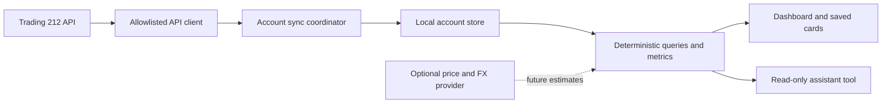

# Trading 212 improvement plan

Status: core implementation delivered on 29 September 2026. Phases 0–2 and the phase-3 dashboard/inspection controls are implemented; the [feature guide](features/trading212.md) is the current user contract. This document preserves the original design below, including later work. All numerical examples are fictional.

Delivered: six capability checks; opt-in encrypted SQLite history; account/currency isolation; resumable, deduplicated scans and immutable event revisions; period performance and income queries shared by chat/UI; value/return charts with funding markers; holdings search/detail; date/type/currency activity filters; pause, export and delete controls; saved-card account binding; updated documentation.

Implementation decisions: Node 24's built-in SQLite works in the development and Electron 41 runtimes. History ordering is not promised by the beta API, so coverage advances only after scans reach the end, rather than assuming an overlap proves completeness. Large accounts can therefore lag the latest valuation. Rolling week/month/quarter/year mean 7/30/90/365 elapsed days; calendar month/year and UK tax-year choices are separate. Detailed holding history is limited to the latest 200 observations in the detail view and retained for 90 days. Charts/evidence are bounded, while export retains full stored records.

Deferred as planned: a stock-price/FX provider (free candidates did not establish suitable stock coverage/display rights), pre-tracking valuation reconstruction, position-level daily attribution, combined accounts, broker CSV report creation, research/news and benchmarks. No write/trading endpoint was added.

Validation: fictional accounting, precision, coverage, storage, account rotation, deletion/export, assistant/UI agreement, correction and lifecycle tests; browser checks of overview, holdings/detail, performance/income and Settings; macOS packaging and bundled-runtime SQLite persistence. The 5,000-observation chart fixture completed in approximately 0.35 seconds on the development machine. Native keychain interaction, real sleep/resume and live broker reconciliation were not exercised in this implementation run; they remain explicit manual integration checks, not claims established by browser fixtures.

## Recommendation

Build a reliable investment dashboard and question-answering layer on top of the existing read-only connector. Prioritise connection diagnostics, persistent account history and shared financial calculations. Then add performance charts, better holdings and income views, and richer questions.

Keep the first release Trading 212-only. Allow a separate market-data integration later, preferably using a free tier, but select it only after verifying instrument coverage, historical FX, data rights and quotas. A price feed alone cannot supply an accurate historical account return. Do not make a paid subscription or a second key necessary for the core dashboard.

The key success case is **“How much am I up today?”** Orb should give the same sourced amount and percentage as the dashboard when the inputs support it. Otherwise, it should identify the missing baseline or history, show a correctly labelled available period, and explain what tracking can collect next. An all-time unrealised gain is never a replacement for today's return.

## 1. Current position and API constraints

The existing implementation is a useful foundation, rather than something to replace:

| Already implemented | Improvement needed |
| --- | --- |
| Encrypted API key/secret; fixed Live/Demo hosts; GET-only endpoint allowlist | Per-capability connection checks and clearer read-permission guidance |
| Overview, holdings, allocation, dividends, trades, cash and pending orders | Meaningful percentages, searchable tables, instrument detail and period views |
| Short memory cache, queues, timeouts, rate-limit handling, partial Overview results | Durable history, background collection while Orb runs, coverage and recovery |
| Manual history pagination and notices about partial data | Automatic bounded history sync, deduplication and complete period queries |
| Read-only chat/voice tool and native financial cards | Deterministic metrics shared with the dashboard, compact evidence for the model |
| Fictional API tests and browser preview | Storage, accounting, lifecycle and end-to-end acceptance fixtures |

The documented API supports Invest and Stocks ISA accounts. It supplies current account and position values, pending orders, historical fills, distributions, cash transactions and instrument/exchange metadata. The current connector uses the first six of those categories, excluding metadata. The API is in beta.

There is no documented endpoint for account daily return, historical portfolio valuations, historical security prices, or company news/fundamentals. CSV reports contain event history rather than a portfolio valuation series. Pies endpoints are deprecated and should not be a core dependency. No additional key permission makes a missing daily-performance endpoint appear.

The API documents multi-currency accounts as unsupported and reports account, position-wallet and result values in the primary account currency; share prices use instrument currency. Individual transaction fields still require their own currency validation. An FX adapter cannot reveal additional wallet balances that the broker API does not expose; missing balances must not be assumed zero. `realizedProfitLoss` on the account summary is all-time; `totalCost` describes currently held investments; position `fxImpact` is not a daily FX return.

The code currently omits the documented account ID from its summary projection, has no durable valuation store, and accumulates history in renderer memory. Connection testing reads only the summary. The assistant receives pages of up to 50 events and has a bounded tool budget, so it cannot reliably obtain a large annual history through repeated model calls.

## 2. Target user experience

### Settings

The Trading 212 card should show the saved account label, Live/Demo environment, account currency, last successful check, and capabilities: account data, holdings, dividends, trade history, cash history and pending orders. Use a masked identifier if needed; the model does not need the broker account number.

**Test connection** should test each implemented capability, obeying existing request limits. It should distinguish valid authentication from access to each feature. A denied view should point to its relevant permission and possible IP restriction; it should not disable other successful views. Timeout, rate limit and denied permission must remain different states.

Keep the [six current read permissions](features/trading212.md#connect). Orders execute and Pies write remain unnecessary. Metadata is optional only if a later feature uses it. Do not ask users to regenerate broader keys merely to run current functionality.

Add **Track performance on this Mac**, with reporting timezone and a clear explanation that observations are collected while Orb is running and the Mac is awake. Existing users should opt into this new persistent data behaviour; connecting without tracking should still permit current-value browsing. Show collection status, history coverage, storage use, pause/resume, export, and delete-local-history controls.

### Overview

Make the main numbers answer distinct questions:

| Card | Meaning |
| --- | --- |
| Account value | Broker-reported total account value in account currency |
| Period return | Cash-flow-adjusted gain and percentage for the selected supported period |
| Open holdings · since purchase | Current unrealised gain and gain divided by current cost basis |
| Invested value / available cash | Current invested value and genuinely available cash, separately |
| Income received | Supported paid distributions and interest for the selected period, with categories |

The period card needs visible states: available, estimated, collecting a baseline, incomplete cash-flow history, stale/offline, and unsupported event. A dash is not zero. Missing daily data should be visible before a user asks chat.

Add Today, 1W, 1M, 3M, YTD, 1Y and Since tracking began as history permits. Define rolling/date boundaries in the persisted reporting timezone and expose the dates. Do not call Since tracking began an all-time account return. Disable unsupported ranges with a reason instead of drawing a fabricated history.

Separate **account value** and **investment return** charts: a deposit raises the first but is not a gain on the second. Mark funding events and gaps. Tooltips and an accessible table must show dates, currencies, sources and estimates. Do not visually interpolate across missing observations as if they were measured.

### Holdings, income and activity

- Holdings: search; sort by name, value, weight and since-purchase return; show return amount and percentage, price currency and account currency. Allocation can switch between investments only and whole account including cash, with its denominator labelled.
- Instrument detail: name, ticker, ISIN, quantity, cost/value, recorded prices, since-purchase FX impact, related fills and paid income. Add period contribution only when the calculation supports position changes and FX; a current-price move is insufficient.
- Income: calendar year, UK tax year (6 April–5 April), custom range, monthly and holding groupings. Separate ordinary dividends, other distributions, cash interest and lending interest. Show gross/net/withholding only where fields support them; do not invent future dividend forecasts or tax liability.
- Activity: date, instrument, type and currency filters; friendly descriptions with original broker event types available. Keep pending orders read-only.
- Preserve filters and keyboard focus during refresh. Users must be able to navigate away or cancel a long history sync. Show fetched-at times per section and explicit retry times when rate-limited.
- Restored chat cards must say **Saved snapshot** and retain their account/time provenance. A separate refresh action fetches live data for the matching connected account; never silently replace an old account's card with another account.

## 3. Financial calculation contract

Implement and test calculations in a pure backend module, used by both UI and assistant. The model should explain calculated values, not invent its own denominator or sum arbitrary partial pages.

### Metric definitions

| Metric | Definition and conditions |
| --- | --- |
| Unrealised gain | Broker-reported current open-holdings P/L; explicitly since purchase |
| Unrealised return % | `unrealised gain / current cost basis × 100`; unavailable for missing or non-positive cost |
| Account value change | `end value − start value`; may include contributions and must not be labelled investment gain |
| Period investment gain | `end value − start value − sum(external flows)`; requires comparable valuations and complete, classified flows |
| Period return with no external flows | `period gain / start value × 100`, with a positive starting value |
| Period return with external flows | Modified Dietz estimate when only periodic valuations exist; see below |
| Net contributions | Classified external contributions minus withdrawals for the requested period |
| Paid income | Sum supported distribution/interest categories over complete requested history, grouped by currency unless conversion is justified |
| Period realised result | Supported fill-level realised P/L over the requested period; keep separate from the summary's all-time realised figure |

First validate the account-value contract. Reconcile the broker summary with investment value and cash categories in representative fixtures and a separate read-only integration check. Confirm whether categories overlap and how pending orders/Pie cash affect them. Do not reconstruct total wealth by summing fields whose relationships have not been established.

For Modified Dietz, let contributions be positive and withdrawals negative:

```text
gain = V_end − V_start − Σ flow_i
weight_i = (period_end − flow_time_i) / (period_end − period_start)
denominator = V_start + Σ (weight_i × flow_i)
return_percent = 100 × gain / denominator
```

Use actual elapsed time between observations, including DST effects. Label this percentage **estimated**. A simple division by the opening value is wrong when substantial funds arrive or leave mid-period. If the denominator is missing or non-positive, return an unavailable percentage with its reason.

Require a strictly positive observation interval. Adopt `(actual_start, actual_end]` for events only once the starting valuation is known to include events through its boundary and the ending valuation includes events through its boundary. Never subtract a contribution already contained in the opening value. Fetch timestamps alone cannot prove that relationship: events coincident with a capture window require reconciliation or a later consistent observation; unresolved ties remain unavailable.

Exact time-weighted returns require valuations around external-flow boundaries. Periodic snapshots alone do not supply those. Do not claim exact TWR; introducing it later requires new input coverage and tests. Do not add daily percentages to make monthly returns or present net-contribution ratios as investment returns.

### Event classification and currency

Buys and sells inside the account move value between cash and securities; they are not external flows. Dividends, cash interest, lending interest, fees and taxes affect total account wealth and must not be added or subtracted a second time when deriving total return. Income breakdowns explain components, rather than adding extra performance.

Verify broker amount signs with fixtures; do not negate a withdrawal twice. Classify transfers by whether assets crossed this specific account boundary. `TRANSFER`, free-of-payment securities, corrections, corporate actions and missing currencies need explicit handling. Unknown material transfers block a confident account return; never silently assume zero external flow. Do not ask the language model to resolve ambiguous accounting.

Complete external-flow coverage requires both cash-transaction history and historical fills, or another verified source ruling out securities transfers. `FOP` and `FOP_CORRECTION` can appear in fills without a matching cash deposit. Complete cash history plus denied or incomplete order history is insufficient for a reliable return; current-value browsing should still work.

Use documented wallet amounts and contemporaneous conversion data when available. Keep unconvertible amounts separate. GBP and GBX require a 100:1 unit conversion, not a foreign-exchange quote. External FX, if added, needs an as-of timestamp and appropriate historical rate; today's FX must not silently convert past events.

Use decimal-safe arithmetic and lossless identifiers at ingestion. Converting an already-rounded JavaScript number to a string does not recover an int64 account/order/fill ID. Preserve source precision; round only for display and define reconciliation tolerances per currency. Missing source amounts remain missing.

### What “Today” means

Default to the saved reporting timezone, initially Europe/London for this setup. Today runs from local 00:00 to the latest usable observation. Store observations in UTC and retain the timezone used for each result. A setting change changes requested boundaries; it must not rewrite original observations.

This is a calendar-day account metric. An instrument's change since its previous exchange close is a different metric. Mixed UK/US holdings do not have one shared exchange close, and Orb should not promise its daily number will exactly match Trading 212's app methodology.

Proposed boundary rule: prefer an observation captured at the requested boundary. A nearest observation within five minutes may support **Today · estimated baseline**, only with known flow coverage across the offset and the actual start time shown. An observation outside that tolerance cannot become today's baseline by carry-forward. The tolerance is a tested product policy, not evidence that prices are exact to the minute; broker quote times may be unavailable.

| Available observations | Expected result |
| --- | --- |
| Usable near-midnight baseline and current observation; complete flow coverage | Today amount/% with method, actual times and any estimate qualifier |
| First connection at 10:05 | “Tracking started at 10:05”; offer “Since 10:05” when another comparable observation exists |
| App closed overnight; last observation yesterday afternoon | Today unavailable; offer the exact observed interval, not a relabelled daily number |
| Mac asleep through an entire weekend | Show the gap; do not manufacture Saturday/Sunday/day-opening valuations |
| Current summary valid but holdings failed | Whole-account return may remain available; position attribution is unavailable |
| Incomplete cash history or unresolved asset transfer | Do not present account value change as investment return |

The no-flow and Dietz formulas must use the actual observation interval and flows in that same interval. Do not use a nominal midnight denominator with midmorning inputs. Late or corrected events can revise prior calculated results; version the calculation and explain a revision.

## 4. Data, sync and privacy architecture

Keep the existing client responsible for authenticated reads. Add distinct modules with narrow responsibilities; filenames below are proposals, not existing files.



| Module / integration | Planned responsibility |
| --- | --- |
| `src/trading212.cjs` | Preserve GET-only transport, validated endpoints, bounded responses and pacing; retain required identity, tax and event fields |
| `src/trading212-store.cjs` | Versioned account records, observations, events, checkpoints, coverage, encrypted payloads and deletion |
| `src/trading212-sync.cjs` | Per-account scheduling, resumable pagination, deduplication, overlap refresh, backoff and cancellation |
| `src/trading212-metrics.cjs` | Pure calculations, period/group queries, validation and metric provenance |
| `src/main.cjs` / `src/preload.cjs` | Trusted typed IPC, separate sync lifetime, settings migration and OS resume handling |
| `src/agent.cjs` | Semantic metric queries and concise, source-backed model responses |
| `src/trading212-ui.js` / `src/trading212.css` | Capability status, history controls, charts/tables and explicit data states |
| Preview fixtures and `test/` | Reusable fictional accounts covering complete, partial, offline and unsupported states |

### Account identity and records

Use an internal opaque account ID mapped to **environment + broker account ID**; bind datasets to their account currency and handle a currency change as a new valuation series requiring validation. Keep the existing random `connectionId` for runtime cursor isolation. Credential rotation for the same verified account can resume its history. A different account or environment must never inherit those records.

Persist:

- Accounts: identity, label, currency, capability results, tracking choice and reporting timezone.
- Observations: summary and holdings payloads, separate fetch times, capture window, source/schema version, validation flags and any actual broker timestamps. Fetched-at is not a guaranteed market quote timestamp.
- Events: original source ID/reference, event type, event timestamp, retrieval timestamp, amounts/currencies and required corporate-action/tax fields. Retain enough projected source evidence to reproduce metrics, without credentials or full HTTP dumps.
- Coverage: requested and covered intervals per endpoint, cursor/checkpoint, completion evidence, gaps, last successful sync and retry status.
- Metric results: baseline/end references, flow record references, method/version, status and revision. Recomputable caches must not become the financial source of truth.

Recommended storage is transactional SQLite under `app.getPath('userData')/trading212/`, outside the vault. Before committing to a driver, verify runtime support in packaged Electron and ordinary test Node. Prefer a supported built-in route if available; do not assume Electron and system Node expose identical modules. Benchmark a representative large fictional history before setting storage limits.

Encrypt financial payloads at rest using a local data key protected by `safeStorage`; use authenticated encryption with record/account binding. Keep plaintext indexes minimal and document what metadata remains visible. Key loss or encryption unavailability must fail clearly rather than fall back to plaintext. Backups, migrations and recovery must preserve the last valid store and avoid unencrypted temporary payloads.

Proposed retention: retain summary observations, event ledger, coverage and referenced calculation evidence until the user deletes them; keep detailed holding observations for 90 days, preserving any records referenced by retained metrics before pruning. Show that older position attribution may be unavailable. Validate footprint and compaction during the storage spike; do not silently sacrifice evidence to a quota. Provide explicit export/delete and a visible storage warning if collection must pause.

### Sync behaviour

1. On tracking enablement, establish identity, validate available capabilities, capture the first observation and start bounded history sync.
2. On launch, connection save, OS resume and manual refresh, fetch current summary/holdings and refresh the recent event window. Coalesce concurrent UI and assistant requests.
3. Proposed default: capture every five minutes while the Mac is awake and Orb runs; at most once per minute while the dashboard is active. Request near-boundary observations when awake. Background collection is independent of hiding the window or stopping a conversation.
4. Prioritise cash and fill coverage needed to classify external flows for the current performance period. Backfill older cash, fills and income in bounded batches, with progress, pause/cancel and restart checkpoints. A year query may start or extend this sync; it must not block the UI or exhaust the assistant's tool budget.
5. Track all seen cursors to detect multi-page loops. Deduplicate and upsert documented source IDs/references; establish and test a fallback where the API lacks a stable key. Preserve corrections rather than counting them again.
6. Refresh overlapping recent history for late events and provide a deeper rescan action. Older results retain their last-verified timestamp; a short overlap is not proof that the broker never revises older events.
7. Honour per-account limits shared with other applications, reset/retry headers and bounded jittered backoff. Retain last good data through offline, 401, 403, 429 and server failures. Do not mislabel a stale value as current.
8. Quit/disconnect/pause must cancel relevant work and safely save checkpoints. Resume must inspect the time gap before calculating returns. No sleep prevention, launch daemon or always-on cloud service is part of this plan.

Initial policy budgets should remain comfortably below the documented endpoint limits: summary and pending orders 1 request/5 seconds, positions 1/second, each history endpoint 6/minute. These are ceilings, not polling targets. Metadata has separate slower limits. Recheck the official reference before implementation.

Do not mark period coverage complete merely because a page has fewer than 50 records or some old event was seen. Verify endpoint ordering/boundary semantics; otherwise traverse to exhaustion to establish historical coverage. Anchor coverage to the fetched observation interval, refresh after current values, and expose possible publication lag. Trading 212's separate endpoints are not an atomic account snapshot. If an event arrives during capture, retry/reconcile or flag the result instead of claiming consistency.

### Data controls

Disconnect removes credentials, stops collection and clears live caches; retained local history is a separate, clearly labelled choice. Pause keeps credentials/history but stops scheduled reads. Delete local investment history removes the account's stored observations, events and derived results; it does not revoke the broker key or erase old chat messages or vault notes. Document those separate deletion paths and do not promise secure erasure of device backups.

Dashboard viewing and local calculation require no AI request. Chat sends only the necessary selected metric/evidence to the configured providers. Never send API credentials or the broker account number. Keep report saving to vault notes an explicit user action under the existing undo rules. Financial history should not silently enter the knowledge graph, starter vault or general logs.

## 5. Assistant contract and acceptance prompts

Extend the read-only tool with a semantic query interface, conceptually:

```json
{
  "metric": "account_performance",
  "period": "today",
  "account": "current",
  "instrument": null,
  "groupBy": null
}
```

Use a validated enum/schema, resolved dates and opaque account selection; do not expose SQL, arbitrary network URLs or credentials. Keep current view browsing available. Pagination and calculations belong to the shared service, not repeated language-model arithmetic.

Every metric result needs: metric ID, amount/percentage or null, currency/units, requested range/timezone, actual observation range, method, status (`available`, `estimated`, `partial`, `unavailable`), separate freshness/coverage fields, evidence IDs, warnings and supported next action. Return a sync job/status for long backfills, with bounded progress checks; the model must not loop through every history page. Minimise raw rows and support inspecting evidence in the dashboard.

| User request | Required behaviour |
| --- | --- |
| “How much % am I up today?” | Use account performance for Today; state amount, percentage and estimate/time basis, or the specific missing input |
| “What is my return since buying?” | Give open-holdings unrealised amount/% and label the denominator |
| “What dividends did I receive this tax year?” | Resolve exact tax-year dates; sum the requested paid-income categories only with stated coverage |
| “How much did I deposit this month?” | Query classified deposits; distinguish gross deposits from net contributions |
| “Which holdings lost the most?” | Name the basis (default since-purchase unrealised loss); use the matching sorted metric |
| “Why am I down today?” | Show supported contributors when available; never invent price/FX attribution or a news cause |
| “Why does this differ from Trading 212?” | Explain actual dates, methodology, cash scope, freshness and known coverage, without alleging a broker error |

When today's baseline is missing, lead with that short explanation and the actual observed period available. Do not distract with an unrelated lifetime gain unless explicitly presented as a separate requested comparison. UI, typed chat and voice must share the same result contract. Spoken answers can be short while the card holds full evidence.

## 6. Optional market data: decision and selection gate

User preference: another integration is acceptable if useful, preferably free; selecting or skipping it is delegated to this plan. **Decision: defer the integration, retain a clean adapter boundary, and evaluate a free option after the local metrics work.** No provider is selected or required by this document.

Official provider pages checked 29 September 2026 support that decision:

| Candidate | Verified offering and implication |
| --- | --- |
| [Twelve Data](https://twelvedata.com/pricing) | Free Basic lists 8 API credits/minute, 800/day and **internal non-display usage**. Internal display and global end-of-day equities/ETFs appear under paid Grow. Do not assume free LSE/UK ETF coverage or display rights for Orb; the [terms](https://twelvedata.com/terms) tie permitted use to the subscription. |
| [Alpha Vantage](https://www.alphavantage.co/support/) | Standard free access is 25 API requests/day; unlimited requests require verified open-source/educational eligibility. Real-time and 15-minute delayed US prices are premium. Intended UK/ETF coverage, historical endpoint entitlements and desktop display terms remain unverified. Do not base the feature on an unapproved exemption. |
| [Frankfurter v2](https://frankfurter.dev/) | No key and no daily/monthly quota, with abuse rate-limiting; supplies daily historical reference FX, not security prices or intraday broker conversion rates. A promising optional FX candidate. Select an explicit source such as `providers=ecb`, retain its date, and check the [underlying provider terms](https://frankfurter.dev/license/#providers) before shipping. |

These are documentation findings, not tests of a live free account or proof of instrument coverage. Recheck plans and terms at implementation. The core release should remain useful if none of these services is enabled.

Useful later outcomes include security price history, a separately labelled previous-close move, daily FX references and researched company context. They do not automatically produce historical account performance. Full reconstruction additionally requires positions through time, closed positions, cash, exact trade timing, corporate actions, fees, asset transfers and suitable historical FX.

Current holdings multiplied by yesterday's price measures a hypothetical basket, not what this account actually earned today. Adjusted prices can double-count dividends or splits if combined with an event ledger incorrectly. Daily closes cannot reconstruct an arbitrary intraday starting value.

Before implementing any provider, use a small fictional coverage matrix that includes UK and US shares, UK-listed ETFs, multiple share classes, GBP/GBX/USD quotes, delisted/renamed symbols and split/dividend histories. Confirm:

1. Exchange/ISIN/share-class mapping, raw versus adjusted prices and documented timestamps.
2. Coverage of relevant instruments and historical FX at the necessary frequency.
3. Free-tier quotas at the expected portfolio size, caching rules, delays and historical depth.
4. Rights to display/cache the data in this desktop product; free API access alone does not establish those rights.
5. Stable documented API, error behaviour and practical performance with an ordinary free account.
6. A graceful Trading 212-only fallback if the free quota or coverage is insufficient.

If a provider passes, add **Settings → Integrations → Market data**, separate credentials where required, source labels, usage/limit status and opt-in network access. Send instrument identifiers and requested dates as needed, not account credentials, balances or quantities. Keep provider-specific symbols outside the broker identity model. Label reconstructed values as estimates and show mixed-source timestamps.

If no free option passes, ship the core feature without one and present a documented paid choice separately. Do not replace a licensed API with an undocumented website endpoint. Research/news, fundamentals, sector/geographic classification and benchmarks remain later scope, with their own provenance; the current broker metadata does not supply them.

## 7. Delivery sequence and review gates

Sizes are relative engineering scope, not calendar commitments. Split large phases into reviewable changes; each ships its documentation and fictional fixtures with the behaviour.

| Phase | Deliverable | Dependency / size | Exit criterion |
| --- | --- | --- | --- |
| 0 — Definitions and diagnostics | Exact permissions, capability checks, current return percentages, visible daily-data state; confirm identity, amount signs and value reconciliation | Existing connector; small–medium | A summary-only key is visibly partial; since-purchase % is correct; daily limitations appear in UI and chat |
| 1 — Durable account history | Storage/runtime spike, encryption, stable account identity, migrations, event sync, coverage, tracking controls and lifecycle | Phase 0 contracts; large | Restart/key rotation preserve the correct account; duplicates do not inflate data; gaps and incomplete sync remain explicit |
| 2 — Performance and useful answers | Pure metric engine, daily/period cards, funding-adjusted return, query tool, basic value/return chart | Phase 1 evidence; large | “Up today?” passes available/estimated/unavailable cases; UI and assistant agree; every result has traceable inputs |
| 3 — Investigation | Holdings search/sort/detail, income/tax-year queries, activity filters, allocation choices, accessible tables and export | Shared query layer; medium | Full requested ranges are supported or visibly partial; large datasets remain usable in the small window |
| 4 — Optional price/FX provider | Coverage/licensing/quotas spike, then at most one adapter if it passes | Independent provider gate; size determined after spike | Free option demonstrably works for intended instruments, or the decision to skip is recorded |
| 5 — Later expansion | Multiple named accounts, carefully defined combined view, supported report import, optional research/benchmarks | Stable single-account feature; separate plans | No account/currency/transfer mixing; each addition has a justified data source |

**First useful release:** phases 0–2, with basic charting and income queries over the new store. It delivers meaningful answers and tracked-period performance without waiting for external prices or advanced research. It still cannot promise today's return when no usable opening observation exists.

**Suggested implementation changes, in order:**

1. Capability model, exact setup help, precision/identity ingestion and current-value metric tests.
2. Account store, encryption/runtime validation, migrations and deletion/export semantics.
3. Resumable history sync, capture lifecycle and coverage fixtures.
4. Pure performance/income/contribution queries and accounting edge cases.
5. Dashboard states, charts, semantic assistant tool and shared evidence rendering.
6. Holdings/detail/filter polish, documentation walkthrough and packaged read-only comparison.

Do not expand the order-execution allowlist, implement trading, request write permissions, or treat Pies as essential. Broker CSV report generation, if later useful, requires its own review: it is an absent POST endpoint today, the permission must be verified, and creating a report is distinct from placing a trade. Prefer local export of already obtained records for the first release. Automated alerts, cloud collection and combined-account tax calculations are outside the first release.

## 8. Verification and definition of done

### Meaningful offline scenarios

| Fixture | Expected result |
| --- | --- |
| Start £1,000, end £1,050, no flows | Gain £50; return 5% |
| Start £1,000, deposit £500, end £1,500 | Gain £0; return 0% |
| Start £1,000, withdraw £200, end £800 | Gain £0; return 0% |
| Start £1,000, deposit £500 halfway, end £1,600 | Gain £100; Dietz estimate 8%, not 10% |
| Buy/sell with unchanged prices and no costs | No wealth gain from moving between cash and investments |
| £10 dividend with matching £10 security-value decline | No double-counted total return; £10 income breakdown |
| GBP account, USD holding, only FX changes | Broker account values drive account return; no invented daily FX attribution |
| Unrealised £200, cost £800 | Since-purchase return 25%; zero/missing cost gives unavailable % |
| Unknown transfer, FOP event or unconvertible transaction | Block unsupported return with an actionable reason |
| Incoming securities transfer, cash history complete, order-history permission denied | Return unavailable; cash-only coverage cannot rule out an external contribution |
| Flows at opening/closing boundaries, duplicate timestamps, zero-duration interval | Count only flows outside the opening value and inside the closing value; unresolved capture ties and invalid intervals remain unavailable |
| Split/correction/repeated page/overlapping sync | No duplicate income, cash flow, holdings or realised gain |
| Midday connection, overnight closure, weekend gap, DST and timezone change | Correct actual intervals, calendar labels and availability states |
| Missing field, failed holdings, stale summary or inconsistent capture window | Preserve valid independent metrics; no fabricated zero or fresh status |
| Same-account new key; different account; Live/Demo change | Resume only verified matching history; never combine accounts |
| int64 IDs above JavaScript safe integer range; fractional shares and GBX | Lossless identity, correct unit conversion and decimal calculations |
| Interrupted migration/sync, locked key store, deletion during sync | Recover last good state; no plaintext fallback or resurrected deleted records |
| 401/403/429/offline, multi-page cursor loop, long history | Bounded retries, cancellable progress, stale data preserved and no model paging loop |
| Summary-only permission set | Correct capability report; successful views stay usable |

Run targeted new tests and the full `npm test` suite for implementation changes. Test the assistant query routing with fictional provider responses and ensure saved cards retain account/version provenance. A matching table and model answer must derive from the same metric result, not separate code paths.

Browser checks should cover 870 × 560 and narrower windows, long lists, keyboard navigation, screen-reader labels, non-colour gain/loss indicators, table overflow, and loading/partial/empty/offline states. Preview checks cannot verify macOS encryption, OS sleep/resume or real broker behaviour.

Before releasing storage/lifecycle changes, package the Electron app and validate the chosen storage runtime, encryption, reopen, hide, quit, resume and disconnect on macOS. Separately compare read-only summary, positions, income and event signs with Trading 212 using the configured account; keep real balances/IDs out of fixtures, logs and screenshots. Record what was actually checked. A manual broker comparison does not prove the same daily methodology.

The release is ready when financial results are reproducible, unavailable cases are useful, history survives normal restarts, no data crosses account boundaries, existing read-only guarantees still hold, and documentation matches observable behaviour.

## 9. Documentation and rollout

Update these alongside each delivered phase:

- [Trading 212 guide](features/trading212.md): permission mapping, tracking setup, daily/period definitions, example walkthrough, data states and known limits.
- [Privacy](privacy.md): persistent store location, encryption, retention, collection while hidden, pause/disconnect/delete, model disclosure and optional provider requests.
- [Development](development.md): module ownership, schemas/migrations, IPC/tool contracts, sync lifecycle, calculation fixtures and packaged validation.
- [Things to ask Orb](things-to-ask.md): available intent and prerequisites, with read-only versus explicit note-save behaviour.
- [Troubleshooting](troubleshooting.md): partial key access, IP restriction, missing opening valuation, history gaps, rate limits, stale data and broker differences.
- [Documentation index](README.md): maintain separate links for this proposed roadmap and the shipped user guide.

Keep existing connections usable during migration. Do not silently enable long-term financial storage for existing users. Preserve old chat cards with their original payload/version and provide a compatible renderer. An opt-in tracking rollout should begin with diagnostics and fictional tests, then a read-only integration check; do not present proposed metrics as already available.

## Sources and implementation reviewed

- [Trading 212 public API](https://docs.trading212.com/) and [OpenAPI schema](https://docs.trading212.com/_bundle/api.yaml), reviewed 29 September 2026: supported accounts, endpoint fields, pagination, rate limits and API limitations.
- [Official API-key setup](https://helpcentre.trading212.com/hc/en-us/articles/14584770928157-Trading-212-API-key): key/secret and access setup.
- Current [API client](../src/trading212.cjs), [main-process integration](../src/main.cjs), [assistant tool](../src/agent.cjs), [dashboard](../src/trading212-ui.js), [tests](../test/trading212.test.cjs), [privacy guide](privacy.md) and [development guide](development.md).

The original planning review inspected code and public documentation without accessing a live account. The implementation status and verification limits above supersede its original proposed status. No actual account return or key permissions were inspected during this work.
